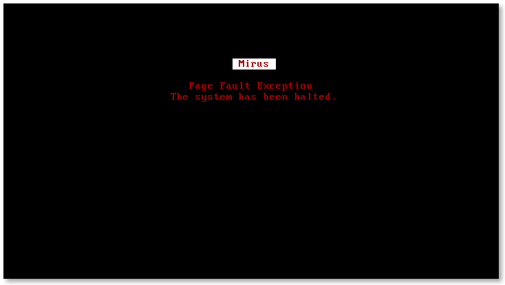

# Mirus
Mirus is a new operating system designed for scalability, security, and modularity.

[](docs/resc/images/frown.png)

### Features
* Dynamic, node based filesystem
* Resilient driver framework
* Fast and lean microkernel
* Modular architecture

## Testing [](https://travis-ci.org/joshbeitler/mirus)
In order to test drive Mirus, you will need to build it from the source - which is a relatively painless task. You will want to clone and build from the `newsrc` branch.  Detailed build instruction can be
found in the `BUILDING.md` file, including instructions for cross platform builds on OSX and Windows.
```
git clone git@github.com:joshbeitler/mirus.git
cd mirus
rake
```
A build of Mirus with no additional configuration or specified tasks will generate a bootable disk image named `mirus.iso` in the build/ directory. You can burn this to any bootable medium you see fit, or run it in a virtual machine via `rake qemu`.

### Dependencies
To build Mirus, you will need to meet the following dependencies. It is expected that binutils and other standard UNIX utilities are installed, but a few odities are required:

* `clang`
* `grub2`
* `yasm`
* `xorriso`
* `rake`

## Contributing
If you'd like to contribute, we would love you to go ahead. Grab yourself a copy of the source, and get up close and personal with it. It doesn't bite - trust us! Make your changes on a separate fork and send a pull request our way.

### Mailing List
Subscribe to the [mailing list](https://groups.google.com/forum/#!forum/mirus-dev) to get up-to-date development discussion and participate with the developers.

### Issue Tracker
If you run into issues (which we almost guarantee you will), please post them on the [issue tracker](https://github.com/joshbeitler/mirus/issues). Please tag and describe your issue in detail, and if any error codes are provided please include them.

### Getting Help
We are active on Twitter at [@mirusproject](http://twitter.com/mirusproject), as well as the IRC channel `#mirus` on `irc.freenode.net`. Detailed documentation can be found on the [wiki](https://github.com/joshbeitler/mirus/wiki) or in the docs/ directory of the source.

## License
```
Licensed under the Apache License, Version 2.0 (the "License");
you may not use this file except in compliance with the License.
You may obtain a copy of the License at

http://www.apache.org/licenses/LICENSE-2.0

Unless required by applicable law or agreed to in writing, software
distributed under the License is distributed on an "AS IS" BASIS,
WITHOUT WARRANTIES OR CONDITIONS OF ANY KIND, either express or implied.
See the License for the specific language governing permissions and
limitations under the License.
```
